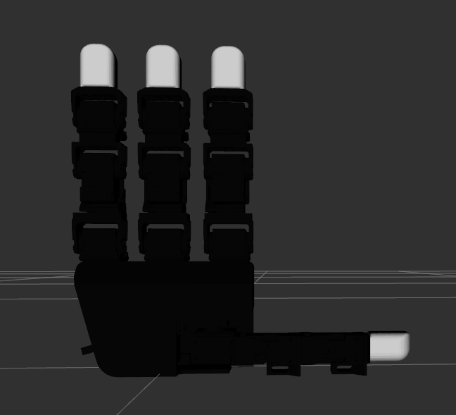
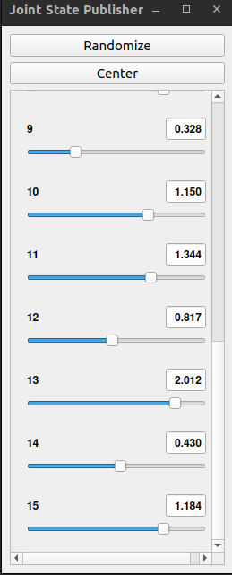

# ROS2 Leap Hand Description Package
 
ROS2 package for launching and visualizing the urdf of the leap hand grippers. Only works for the right hand currently, but I hope to add more soon. 
 
This README assumes that you have the following ROS2 installation setup:

    - Ubuntu Distro=="jammy"
    - ROS2_DISTRO=="humble"

To install this package, perform the following steps:
- Clone the repo in your ROS2 workspace folder.
- Run `rosdep install --from-paths src --ignore-src -r -y --rosdistro=humble`
- Run `colcon build` (append `--packages-select leap_description` to your build command if you want to build just this package).
- Source your workspace and ROS2 installation.
- Run `ros2 launch leap_description view_gripper.launch.py`

You should see the following windows pop up if everything works as it should:

|          |         |
| -------- | ------- |
| | |
| Center Grasp Pose on RViZ   | Joint State Publisher GUI |
|          |         |
